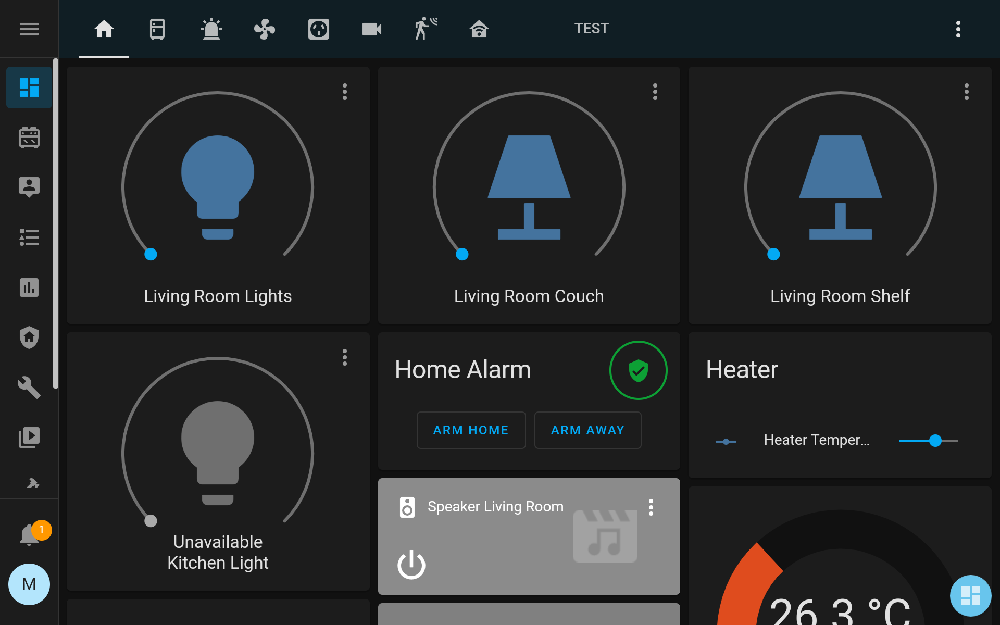
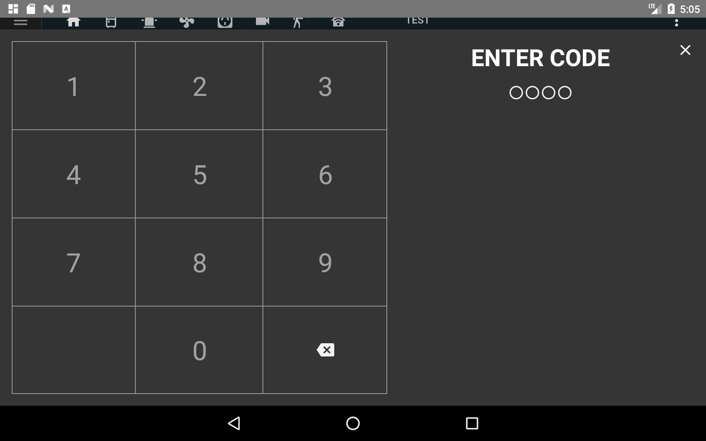
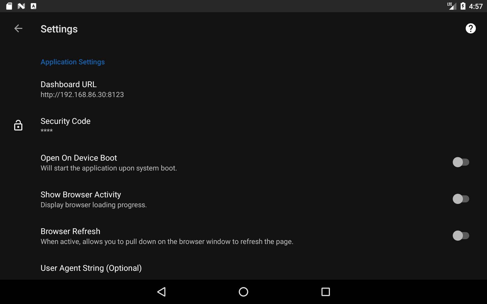

# WallPanel
WallPanel is an Android application for Web Based Dashboards and Home Automation Platforms. You can either side load the application to your Android device from the [release section](https://github.com/thanksmister/wallpanel-android/releases), install the application from  [Google Play](https://play.google.com/store/apps/details?id=com.thanksmister.iot.wallpanel) or get WallPanel from the [Amazon Appstore](https://www.amazon.com/dp/B08S8XZ7LN/). 

## Screenshots




## Support
For issues, feature requests, use the [Github issues tracker](https://github.com/thanksmister/wallpanel-android/issues). Join the [ThanksMister Discord](https://community.thanksmister.com/) to ask questions or share any helpful information about this project.  For examples and to learn how to use each feature, vist the new [WallPanel Wiki](https://github.com/thanksmister/wallpanel-android/wiki).

## Features
- Web Based Dashboards and Home Automation Platforms support.
- Set application as Android Home screen (optional)
- Use code to access the settings and make the settings button invisible.
- Camera support for streaming video, motion detection, face detection, and QR Code reading.
- Google Text-to-Speech support to speak notification messages using MQTT or HTTP.
- MQTT or HTTP commands to remotely control device and application (url, brightness, wake, etc.).
- Sensor data reporting for the device (temperature, light, pressure, battery).
- Streaming MJPEG server support using the device camera.
- Screensaver feature that can be dismissed with motion or face detection.
- Support for Android 4.4 (API level 19) and greater devices.
- Support for launching external applications using intent URL

## Hardware & Software 

- Android Device running Android OS 4.4 or greater.  Note: The WebView shipped with Android 4.4 (KitKat) is based on the same code as Chrome for Android version 30. This WebView does not have full feature parity with Chrome for Android and is given the version number 30.0.0.0.  

*** If you have need support for older Android 4.0 devices (those below Android 4.4), you want to use the [legacy](https://github.com/thanksmister/wallpanel-android-legacy) version of the application. Alternatively you can download an APK from the release section prior to release v0.8.8-beta.6 *** 

## Quick Start
You can either side load the application to your device from the [release section](https://github.com/thanksmister/wallpanel-android/releases)  or install the application from [Google Play](https://play.google.com/store/apps/details?id=com.thanksmister.iot.wallpanel). The application will open to the welcome page with a link to update the settings. Open the settings by clicking the dashboard floating icon. In the settings, set your web page or home automation platform url. Also set the code for accessing the settings, the default is 1234.

## Building the Application 
To build the application locally, checkout the code from Github and load the project into Android Studio with Android API 27 or higher.  You will need to remove the Firebase dependency in the build.gradle file, this is not required.  Remove the following dependencies:

```
apply plugin: 'com.google.firebase.crashlytics'

implementation 'com.google.firebase:firebase-core:18.0.0'
implementation 'com.google.firebase:firebase-crashlytics:17.3.0'
implementation 'com.google.firebase:firebase-analytics:18.0.0'
```
Remove this if you are building the application for devices that do not support Google Services.

```
apply plugin: 'com.google.gms.google-services'

implementation 'com.google.android.gms:play-services-vision:20.1.3'
```

The project should compile normally.

## Limitations
Android devices use WebView to render webpages, This WebView does not have full feature parity with Chrome for Android and therefore pages that render in Chrome may not render nicely in Wall Panel. For example, WebView that shipped with Android 4.4 (KitKat) devices is based on the same code as Chrome for Android version 30. 

This WebView does not have full feature parity with Chrome for Android and is given the version number 30.0.0.0.  If you find that you cannot render a webpage, it is most likely that the version of WebView on your device does not support the CSS/HTML of that page.  You have little recourse but to update the webpage, as there is nothing to be done to the WebView to make it compatible with your code. 

Setting WallPanel as the default Home application will always load this application as your home.  Removing this feature is difficutl without uninstalling the application.  So please do this is you wish to use the application as a "kiosk" type application.  


## Contribution

WallPanel (Formerly HomeDash) is a fork from the [original WallPanel project](https://github.com/WallPanel-Project/wallpanel-android) developed by [quadportnick](https://github.com/quadportnick). All are welcome to propose a feature request, report or bug, or contribute to the project by updating examples or with a PR for new features.  Thanks to all the [contributes[(https://github.com/thanksmister/wallpanel-android/graphs/contributors) who have contributed to the project!
